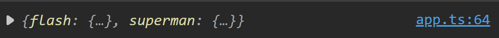

# Apuntes TypeScript

[Documentación](https://www.typescriptlang.org/)

Super set de JavaScript, expandiendo funcionalidades como agregando tipado estricto, interfaces, etc. También permite utilizar las últimas caracteristícas y traducirlas al estandar de JS que se necesitaría correr.

Instalación a nivel global: `pnpm add -g typescript`

## Comandos básicos

- `tsc --init`: crear archivo tsconfig.json (archivo de configuración de TS)
- `tsc -w`: modo observador de cambios

### tsconfig.json

Para poder ver correctamente alguna línea de error en la consola del navegador por estar utilizando TS, se puede activar la opción _sourceMap_ para generar un archivo .map, esto nos ayudará para depurar mucho mejor nuestro código. Estos archivos solo deberían estar en el modo dev.

Sin .map


Con .map



Con la opción _removeComments_ evitaremos pasar nuestros comentarios de TS al archivo de salida de JS para así ahorrar unos bytes del lado del cliente.

Comúnmente, al momento de hacer la transpilación del código todo quedaría en un solo archivo JS y para poder especificiar ese archivo se utiliza la opción _outFile_ pero esta configuración solo permite module _AMD_ o _System_.

La opción _exclude_ permite indicar las rutas donde se evitará hacer seguimientos de los archivos TS.

[Documentación de tsconfig.json](https://www.typescriptlang.org/docs/handbook/tsconfig-json.html)

## Tipos de datos

TypeScript permite crear nuevos tipos de datos como: interfaces, genéricos y tuplas.

- **Primitivos**: string, number, boolean, symbol
- **Compuestos**: objetos literales (llave, valor), funciones, clases, arreglos
- **Tupla**: indica el valor específico en la posición de array
- **Enun**: ayuda a trabajar con valores que tienen sentido semántico y fácil de leer
- **Void**: es una forma de indicar que no hay un valor de retorno
- **Never**: indica que algo, por ejemplo una función, no debe terminar de manera exitosa sino con un error
- **Type**: palabra reservada para definir un tipo, o sea, asignar reglas o "contratos" a un objeto o variable que debe cumplir
- **Interface**: muy similar al type siendo la única diferencia que las interfaces son expandibles, o sea, poder agregar más propiedades según se vayan necesitando. Con _implements_ se puede relacionar una interface a una clase

Una función puede recibir parámetros opcionales especificados con el símbolo _?_, estos valores opcionales siempre debe ir al final. También se pueden indicar valores por default con el símbolo _=_. Se pueden capturar parámetros de manera indefinida mediante la sintáxis _rest_ (...).

```ts
function demo(firstname: string, isAdmin: boolean = false, lastName?: string, ...args: string[]) {}
```

Con el siguiente por ejemplo, se define una variable que puede recibir como valor una función la cual no recibe parámetros y que devuelve un string: `let myFunction: () => string`

El ciclo _for of_ nos permite recorrer un arreglo (o cualquier otro iterable como string o NodeList) de forma más sencilla, a diferencia del _for in_ que esta orientado a recorrer las propiedades de un objeto.

### Clases

- **Public**: permite que la propiedad/método sea vista por fuera de la clase
- **Private**: indica que solo se tiene acceso a la propiedad/método dentro de la clase
- **Static**: permite acceder a una propiedad/método sin necesidad de crear una instancia, solo haciendo referencia a la clase
- **Protected**: permite acceder a una propiedad/método dentro que clases que extienden de otras
- **Set**: es un método que recibe un solo parámetro y establecerlo dentro de la clase
- **Get**: método para obtener algo, este siempre debe devolver algún dato y a diferencia de una función no es necesario invocarlo con los ()
- **Extends**: permite heredar de otra clase sus métodos y propiedades
- **Abstract**: no permite crear instancias, es una clase que sirve para crear otras clases o asegurarse que otras clases implementen lo que se espera, tambíen sirve para indicar que se espera un objecto o argumento que tenga el tipo/característica de la clase abstracta

### NameSpaces, Imports y Exports

Se utilizan para encapsular y agrupar el código para prevenir conflictos de nombres, y exponer mediante _export_ lo que se necesite. Aunque son similares a los módulos comunmente no son tan utilizadas en el desarrollo en vista que los frameworks ya lo estan utilizando en una capa más abajo.

Actualmente lo más utilizado son los _imports_ y _exports_ para modularizar el código, ya sean clases, funciones, arreglos, funciones, variables, etc.

```ts
// Export: hero.ts
export class Hero {
  constructor(public name: string, public age: number) {}
}

// Import: app.ts
import { Hero } from './Hero'
const hero = new Hero('test', 123)
```

- **Alias**: permite mediante un _as_ asignar un nuevo nombre a la importación para que no choque con otras variables, en caso de existir una con el mismo nombre: `import { Hero as SuperHero } from './Hero'`
- **\***: crear una sola instancia de todas las exportaciones de un archivo: `import * as Hero from './Hero'`
- **Default**: una exportación por default es declarar una exportación principal e independiente, pero de todas formas se puede seguir haciendo otras exportaciones del mismo archivo: `export default Hero`
