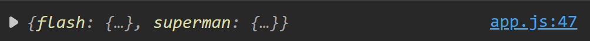

# Apuntes TypeScript

[Documentación](https://www.typescriptlang.org/)

Super set de JavaScript, expandiendo funcionalidades como agregando tipado estricto, interfaces, etc. También permite utilizar las últimas caracteristícas y traducirlas al estandar de JS que se necesitaría correr.

Instalación a nivel global: `pnpm add -g typescript`

## Comandos básicos

- `tsc --init`: crear archivo tsconfig.json (archivo de configuración de TS)
- `tsc -w`: modo observador de cambios

### tsconfig.json

Para poder ver correctamente alguna línea de error en la consola del navegador por estar utilizando TS, se puede activar la opción _sourceMap_ para generar un archivo .map, esto nos ayudará para depurar mucho mejor nuestro código. Estos archivos solo deberían estar en el modo dev.

Sin .map



Con .map


Con la opción _removeComments_ evitaremos pasar nuestros comentarios de TS al archivo de salida de JS para así ahorrar unos bytes del lado del cliente.

Comúnmente, al momento de hacer la transpilación del código todo quedaría en un solo archivo JS y para poder especificiar ese archivo se utiliza la opción _outFile_ pero esta configuración solo permite module _AMD_ o _System_.

La opción _exclude_ permite indicar las rutas donde se evitará hacer seguimientos de los archivos TS.

[Documentación](https://www.typescriptlang.org/docs/handbook/tsconfig-json.html)

## Tipos de datos

TypeScript permite crear nuevos tipos de datos como: interfaces, genéricos y tuplas.

- **Primitivos**: string, number, boolean, symbol
- **Compuestos**: objetos literales (llave, valor), funciones, clases, arreglos
- **Tupla**: indica el valor específico en la posición de array
- **Enun**: ayuda a trabajar con valores que tienen sentido semántico y fácil de leer
- **Void**: es una forma de indicar que no hay un valor de retorno
- **Never**: indica que algo, por ejemplo una función, no debe terminar de manera exitosa sino con un error
- **Type**: palabra reservada para definir un tipo, o sea, asignar reglas o "contratos" a un objeto o variable que debe cumplir

Una función puede recibir parámetros opcionales especificados con el símbolo _?_, estos valores opcionales siempre debe ir al final. También se pueden indicar valores por default con el símbolo _=_. Se pueden capturar parámetros de manera indefinida mediante la sintáxis _rest_ (...).

```ts
function demo(firstname: string, isAdmin: boolean = false, lastName?: string, ...args: string[]) {}
```

Con el siguiente por ejemplo, se define una variable que puede recibir como valor una función la cual no recibe parámetros y que devuelve un string: `let myFunction: () => string`
